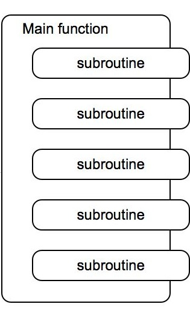
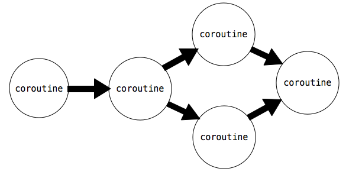

- [5.3 协程](#53-协程)
  - [5.3.1 Python 协程](#531-python-协程)
  - [5.3.2 生产、过滤和消耗](#532-生产过滤和消耗)
  - [5.3.3 多任务](#533-多任务)

## 5.3 协程

这篇文章的大部分专注于将复杂程序解构为小型、模块化组件的技巧。当一个带有复杂行为的函数逻辑划分为几个独立的、本身为函数的步骤时，这些函数叫做辅助函数或者子过程。子过程由主函数调用，主函数负责协调子函数的使用。



这一节中，我们使用协程，引入了一种不同的方式来解构复杂的计算。它是一种针对有序数据的任务处理方式。就像子过程那样，协程会计算复杂计算的一小步。但是，在使用协程时，没有主函数来协调结果。反之，协程会自发链接到一起来组成流水线。可能有一些协程消耗输入数据，并把它发送到其它协程。也可能有一些协程，每个都对发送给它的数据执行简单的处理步骤。最后可能有另外一些协程输出最终结果。



协程和子过程的差异是概念上的：子过程在主函数中位于下级，但是协程都是平等的，它们协作组成流水线，不带有任何上级函数来负责以特定顺序调用它们。

这一节中，我们会学到 Python 如何通过`yield`和`send()`语句来支持协程的构建。之后，我们会看到协程在流水线中的不同作用，以及协程如何支持多任务。

### 5.3.1 Python 协程

在之前一节中，我们介绍了生成器函数，它使用`yield`来返回一个值。Python 的生成器函数也可以使用`(yield)`语句来接受一个值。生成器对象上有两个额外的方法：`send()`和`close()`，创建了一个模型使对象可以消耗或产出值。定义了这些对象的生成器函数叫做协程。

协程可以通过`(yield)`语句来消耗值，向像下面这样：

```py
value = (yield)
```

使用这个语法，在带参数调用对象的`send`方法之前，执行流会停留在这条语句上。

```py
coroutine.send(data)
```

之后，执行会恢复，`value`会被赋为`data`的值。为了发射计算终止的信号，我们需要使用`close()`方法来关闭协程。这会在协程内部产生`GeneratorExit`异常，它可以由`try/except`子句来捕获。

下面的例子展示了这些概念。它是一个协程，用于打印匹配所提供的模式串的字符串。

```py
>>> def match(pattern):
        print('Looking for ' + pattern)
        try:
            while True:
                s = (yield)
                if pattern in s:
                    print(s)
        except GeneratorExit:
            print("=== Done ===")
```

我们可以使用一个模式串来初始化它，之后调用`__next__()`来开始执行：

```py
>>> m = match("Jabberwock")
>>> m.__next__()
Looking for Jabberwock
```

对`__next__()`的调用会执行函数体，所以`"Looking for jabberwock"`会被打印。语句会一直持续执行，直到遇到`line = (yield)`语句。之后，执行会暂停，并且等待一个发送给`m`的值。我们可以使用`send`来将值发送给它。

```py
>>> m.send("the Jabberwock with eyes of flame")
the Jabberwock with eyes of flame
>>> m.send("came whiffling through the tulgey wood")
>>> m.send("and burbled as it came")
>>> m.close()
=== Done ===
```

当我们以一个值调用`m.send`时，协程`m`内部的求值会在`line = (yield)`语句处恢复，这里会把发送的值赋给`line`变量。`m`中的语句会继续求值，如果匹配的话会打印出那一行，并继续执行循环，直到再次进入`line = (yield)`。之后，`m`中的求值会暂停，并在`m.send`调用后恢复。

我们可以将使用`send()`和`yield`的函数链到一起来完成复杂的行为。例如，下面的函数将名为`text`的字符串分割为单词，并把每个单词发送给另一个协程。

每个单词都发送给了绑定到`next_coroutine`的协程，使`next_coroutine`开始执行，而且这个函数暂停并等待。它在`next_coroutine`暂停之前会一直等待，随后这个函数恢复执行，发送下一个单词或执行完毕。

如果我们将上面定义的`match`和这个函数链到一起，我们就可以创建出一个程序，只打印出匹配特定单词的单词。

```py
>>> text = 'Commending spending is offending to people pending lending!'
>>> matcher = match('ending')
>>> matcher.__next__()
Looking for ending
>>> read(text, matcher)
Commending
spending
offending
pending
lending!
=== Done ===
```

`read`函数向协程`matcher`发送每个单词，协程打印出任何匹配`pattern`的输入。在`matcher`协程中，`s = (yield)`一行等待每个发送进来的单词，并且在执行到这一行之后将控制流交还给`read`。


### 5.3.2 生产、过滤和消耗

协程基于如何使用`yield`和`send()`而具有不同的作用：


- **生产者** 创建序列中的物品，并使用`send()`，而不是`(yield)`。
- **过滤器** 使用`(yield)`来消耗物品并将结果使用`send()`发送给下一个步骤。
- **消费者** 使用`(yield)`来消耗物品，但是从不发送。

上面的`read`函数是一个生产者的例子。它不使用`(yield)`，但是使用`send`来生产数据。函数`match`是个消费者的例子。它不使用`send`发送任何东西，但是使用`(yield)`来消耗数据。我们可以将`match`拆分为过滤器和消费者。过滤器是一个协程，只发送与它的模式相匹配的字符串。

```py
>>> def match_filter(pattern, next_coroutine):
        print('Looking for ' + pattern)
        try:
            while True:
                s = (yield)
                if pattern in s:
                    next_coroutine.send(s)
        except GeneratorExit:
            next_coroutine.close()
```

消费者是一个函数，只打印出发送给它的行：

```py
>>> def print_consumer():
        print('Preparing to print')
        try:
            while True:
                line = (yield)
                print(line)
        except GeneratorExit:
            print("=== Done ===")
```

当过滤器或消费者被构建时，必须调用它的`__next__`方法来开始执行：

```py
>>> printer = print_consumer()
>>> printer.__next__()
Preparing to print
>>> matcher = match_filter('pend', printer)
>>> matcher.__next__()
Looking for pend
>>> read(text, matcher)
spending
pending
=== Done ===
```

即使名称`filter`暗示移除元素，过滤器也可以转换元素。下面的函数是个转换元素的过滤器的示例。它消耗字符串并发送一个字典，包含了每个不同的字母在字符串中的出现次数。

```py
>>> def count_letters(next_coroutine):
        try:
            while True:
                s = (yield)
                counts = {letter:s.count(letter) for letter in set(s)}
                next_coroutine.send(counts)
        except GeneratorExit as e:
            next_coroutine.close()
```

我们可以使用它来计算文本中最常出现的字母，并使用一个消费者，将字典合并来找出最常出现的键。

```py
>>> def sum_dictionaries():
        total = {}
        try:
            while True:
                counts = (yield)
                for letter, count in counts.items():
                    total[letter] = count + total.get(letter, 0)
        except GeneratorExit:
            max_letter = max(total.items(), key=lambda t: t[1])[0]
            print("Most frequent letter: " + max_letter)
```

为了在文件上运行这个流水线，我们必须首先按行读取文件。之后，将结果发送给`count_letters`，最后发送给`sum_dictionaries`。我们可以服用`read`协程来读取文件中的行。

```py
>>> s = sum_dictionaries()
>>> s.__next__()
>>> c = count_letters(s)
>>> c.__next__()
>>> read(text, c)
Most frequent letter: n
```

### 5.3.3 多任务

生产者或过滤器并不受限于唯一的下游。它可以拥有多个协程作为它的下游，并使用`send()`向它们发送数据。例如，下面是`read`的一个版本，向多个下游发送字符串中的单词：

```py
>>> def read_to_many(text, coroutines):
        for word in text.split():
            for coroutine in coroutines:
                coroutine.send(word)
        for coroutine in coroutines:
            coroutine.close()
```

我们可以使用它来检测多个单词中的相同文本：

```py
>>> m = match("mend")
>>> m.__next__()
Looking for mend
>>> p = match("pe")
>>> p.__next__()
Looking for pe
>>> read_to_many(text, [m, p])
Commending
spending
people
pending
=== Done ===
=== Done ===
```

首先，`read_to_many`在`m`上调用了`send(word)`。这个协程正在等待循环中的`text = (yield)`，之后打印出所发现的匹配，并且等待下一个`send`。之后执行流返回到了`read_to_many`，它向`p`发送相同的行。所以，`text`中的单词会按照顺序打印出来。
